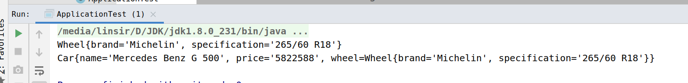
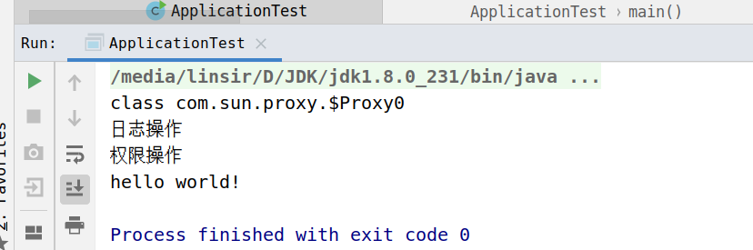

手写实现的 Spring IOC 和 AOP

1.概述

1. 根据 xml 配置文件加载相关 bean
2. 对 BeanPostProcessor 类型的 bean 提供支持
3. 对 BeanFactoryAware 类型的 bean 提供支持
4. 实现了基于 JDK 动态代理的 AOP
5. 整合了 IOC 和 AOP，使得二者可很好的协同工作

2. 简单的 IOC 和 AOP 实现

2.1 简单的 IOC

先从简单的 IOC 容器实现开始，最简单的 IOC 容器只需4步即可实现，如下：

1. 加载 xml 配置文件，遍历其中的标签
2. 获取标签中的 id 和 class 属性，加载 class 属性对应的类，并创建 bean
3. 遍历标签中的标签，获取属性值，并将属性值填充到 bean 中
4. 将 bean 注册到 bean 容器中

如上所示，仅需4步即可，是不是觉得很简单。好了，Talk is cheap, Show me the code. 接下来要上代码了。不过客官别急，上代码前，容我对代码结构做一下简单介绍：

    SimpleIOC     // IOC 的实现类，实现了上面所说的4个步骤
    SimpleIOCTest    // IOC 的测试类
    Car           // IOC 测试使用的 bean
    Wheel         // 同上 
    spring-ioc.xml       // bean 配置文件

容器实现类 SimpleIOC 的代码：

    package com.jacklin.spring.ioc;
    
    import org.w3c.dom.Document;
    import org.w3c.dom.Element;
    import org.w3c.dom.Node;
    import org.w3c.dom.NodeList;
    
    import javax.xml.parsers.DocumentBuilder;
    import javax.xml.parsers.DocumentBuilderFactory;
    import java.io.FileInputStream;
    import java.io.InputStream;
    import java.lang.reflect.Field;
    import java.util.HashMap;
    import java.util.Map;
    
    /**
     * @author laiqilin
     * @version 1.0
     * @date 2019/11/10 下午10:14
     * ioc实现过程
     */
    public class SimpleIOC {
        //用户存放bean
        private Map<String, Object> beanMap = new HashMap<>();
    
        /**
         * 加载ｂｅａｎ
         *
         * @param location
         * @throws Exception
         */
        public SimpleIOC(String location) throws Exception {
            loadBeans(location);
        }
    
        /**
         * 提供外部回去bean对象
         *
         * @param name
         * @return
         */
        public Object getBean(String name) {
            Object bean = beanMap.get(name);
            if (bean == null) {
                throw new IllegalArgumentException("there is no bean with name " + name);
            }
    
            return bean;
        }
    
        /**
         * 解析xml 加载bean
         *
         * @param location
         * @throws Exception
         */
        private void loadBeans(String location) throws Exception {
            // 加载 xml 配置文件
            InputStream inputStream = new FileInputStream(location);
            //以下解析xml代码
            DocumentBuilderFactory factory = DocumentBuilderFactory.newInstance();
            DocumentBuilder docBuilder = factory.newDocumentBuilder();
            Document doc = docBuilder.parse(inputStream);
            Element root = doc.getDocumentElement();
            NodeList nodes = root.getChildNodes();
    
            // 遍历 <bean> 标签
            for (int i = 0; i < nodes.getLength(); i++) {
                Node node = nodes.item(i);
                if (node instanceof Element) {
                    Element ele = (Element) node;
                    String id = ele.getAttribute("id");
                    String className = ele.getAttribute("class");
    
                    // 加载 beanClass
                    Class beanClass = null;
                    try {
                        beanClass = Class.forName(className);
                    } catch (ClassNotFoundException e) {
                        e.printStackTrace();
                        return;
                    }
    
                    // 创建 bean
                    Object bean = beanClass.newInstance();
    
                    // 遍历 <property> 标签
                    NodeList propertyNodes = ele.getElementsByTagName("property");
                    for (int j = 0; j < propertyNodes.getLength(); j++) {
                        Node propertyNode = propertyNodes.item(j);
                        if (propertyNode instanceof Element) {
                            Element propertyElement = (Element) propertyNode;
                            String name = propertyElement.getAttribute("name");
                            String value = propertyElement.getAttribute("value");
    
                            // 利用反射将 bean 相关字段访问权限设为可访问
                            Field declaredField = bean.getClass().getDeclaredField(name);
                            declaredField.setAccessible(true);
    
                            if (value != null && value.length() > 0) {
                                // 将属性值填充到相关字段中
                                declaredField.set(bean, value);
                            } else {
                                String ref = propertyElement.getAttribute("ref");
                                if (ref == null || ref.length() == 0) {
                                    throw new IllegalArgumentException("ref config error");
                                }
    
                                // 将引用填充到相关字段中
                                declaredField.set(bean, getBean(ref));
                            }
    
                            // 将 bean 注册到 bean 容器中
                            registerBean(id, bean);
                        }
                    }
                }
            }
        }
    
        /**
         * 注册到容器－－－>添加集合容器中
         *
         * @param id
         * @param bean
         */
        private void registerBean(String id, Object bean) {
            beanMap.put(id, bean);
        }
    }

容器测试使用的 bean 代码：

    package com.jacklin.spring.ioc.bean;
    
    public class Car {
        private String name;
        private String price;
        private Wheel wheel;
    
        public Wheel getWheel() {
            return wheel;
        }
    
        public void setWheel(Wheel wheel) {
            this.wheel = wheel;
        }
    
        public String getName() {
            return name;
        }
    
        public void setName(String name) {
            this.name = name;
        }
    
        public String getPrice() {
            return price;
        }
    
        public void setPrice(String price) {
            this.price = price;
        }
    }

    package com.jacklin.spring.ioc.bean;
    
    public class Wheel {
        private String brand;
        private String specification ;
        
        // 省略其他不重要代码
    
    
        public String getBrand() {
            return brand;
        }
    
        public void setBrand(String brand) {
            this.brand = brand;
        }
    
        public String getSpecification() {
            return specification;
        }
    
        public void setSpecification(String specification) {
            this.specification = specification;
        }
    }

bean 配置文件 spring-ioc.xml 内容:

    <beans>
        <bean id="wheel" class="com.jacklin.spring.ioc.bean.Wheel">
            <property name="brand" value="Michelin" />
            <property name="specification" value="265/60 R18" />
        </bean>
    
        <bean id="car" class="com.jacklin.spring.ioc.bean.Car">
            <property name="name" value="Mercedes Benz G 500"/>
            <property name="price" value="5822588"/>
            <property name="wheel" ref="wheel"/>
        </bean>
    </beans>

IOC 测试类 ApplicationTest：

    package com.jacklin.spring.ioc;
    
    import com.jacklin.spring.ioc.bean.Car;
    import com.jacklin.spring.ioc.bean.Wheel;
    
    /**
     * @author laiqilin
     * @version 1.0
     * @date 2019/11/10 下午10:26
     */
    public class ApplicationTest {
    
        public static void main(String[] args) throws Exception {
            String location = SimpleIOC.class.getClassLoader().getResource("spring-ioc.xml").getFile();
            SimpleIOC bf = new SimpleIOC(location);
            Wheel wheel = (Wheel) bf.getBean("wheel");
            System.out.println(wheel);
            Car car = (Car) bf.getBean("car");
            System.out.println(car);
        }
    }

结果：

 2.2 简单的 AOP 实现

AOP 的实现是基于代理模式的，这一点相信大家应该都知道。代理模式是AOP实现的基础，代理模式不难理解，这里就不花篇幅介绍了。在介绍 AOP 的实现步骤之前，先引入 Spring AOP 中的一些概念，接下来我们会用到这些概念。

通知（Advice）

    通知定义了要织入目标对象的逻辑，以及执行时机。
    Spring 中对应了 5 种不同类型的通知：
    · 前置通知（Before）：在目标方法执行前，执行通知
    · 后置通知（After）：在目标方法执行后，执行通知，此时不关系目标方法返回的结果是什么
    · 返回通知（After-returning）：在目标方法执行后，执行通知
    · 异常通知（After-throwing）：在目标方法抛出异常后执行通知
    · 环绕通知（Around）: 目标方法被通知包裹，通知在目标方法执行前和执行后都被会调用

切点（Pointcut）

    如果说通知定义了在何时执行通知，那么切点就定义了在何处执行通知。所以切点的作用就是
    通过匹配规则查找合适的连接点（Joinpoint），AOP 会在这些连接点上织入通知。

切面（Aspect）

    切面包含了通知和切点，通知和切点共同定义了切面是什么，在何时，何处执行切面逻辑。

说完概念，接下来我们来说说简单 AOP 实现的步骤。这里 AOP 是基于 JDK 动态代理实现的，只需3步即可完成：

1. 定义一个包含切面逻辑的对象，这里假设叫 logMethodInvocation
2. 定义一个 Advice 对象（实现了 InvocationHandler 接口），并将上面的 logMethodInvocation 和 目标对象传入
3. 将上面的 Adivce 对象和目标对象传给 JDK 动态代理方法，为目标对象生成代理

上面步骤比较简单，不过在实现过程中，还是有一些难度的，这里要引入一些辅助接口才能实现。接下来就来介绍一下简单 AOP 的代码结构：

    MethodInvocation 接口  // 实现类包含了切面逻辑，如上面的 logMethodInvocation
    Advice 接口        // 继承了 InvocationHandler 接口
    BeforeAdvice 类    // 实现了 Advice 接口，是一个前置通知
    SimpleAOP 类       // 生成代理类
    SimpleAOPTest      // SimpleAOP 从测试类
    HelloService 接口   // 目标对象接口
    HelloServiceImpl   // 目标对象

MethodInvocation 接口代码：

    package com.jacklin.spring.aop;
    
    /**
     * @author laiqilin
     * @version 1.0
     * @date 2019/11/10 下午9:34
     * 

     * 定义一个方法执行接口
     */
    public interface MethodInvocation {
    
        void invoke();
    }

Advice 接口代码：

    package com.jacklin.spring.aop;
    
    import java.lang.reflect.InvocationHandler;
    
    /**
     * @author laiqilin
     * @version 1.0
     * @date 2019/11/10 下午9:39
     * 开发通知接口并继承了 InvocationHandler 接口
     */
    public interface Advice extends InvocationHandler {
    }
    

BeforeAdvice 实现代码：

    package com.jacklin.spring.aop;
    
    import java.lang.reflect.Method;
    
    /**
     * @author laiqilin
     * @version 1.0
     * @date 2019/11/10 下午9:37
     * 实现Advice接口　实现前置通知
     */
    public class BeforeAdvice implements Advice {
    
    
        private Object bean;
    
        private MethodInvocation methodInvocation;
    
        public BeforeAdvice(Object bean, MethodInvocation methodInvocation) {
            this.bean = bean;
            this.methodInvocation = methodInvocation;
        }
    
        /**
         * Jｄｋ动态代理的实现
         *
         * @param proxy  生成代理对象
         * @param method 当前调用的真实方法
         * @param args   当前调用方法的参数
         * @return
         * @throws Throwable
         */
        @Override
        public Object invoke(Object proxy, Method method, Object[] args) throws Throwable {
    
            System.out.println("日志操作");
            // 在目标方法执行前调用通知
            methodInvocation.invoke();
            System.out.println("权限操作");
            return method.invoke(bean, args);
        }
    }

SimpleAOP 实现代码：

    package com.jacklin.spring.aop;
    
    import java.lang.reflect.Proxy;
    
    /**
     * @author laiqilin
     * @version 1.0
     * @date 2019/11/10 下午9:48
     * // 生成代理类
     */
    public class SimpleAOP {
        public static Object getProxy(Object bean, Advice advice) {
            /**
             * 参数1:类加载器定义代理类
             * 参数2:代理类要实现的接口
             * 参数3:代理接口
             */
            return Proxy.newProxyInstance(SimpleAOP.class.getClassLoader(), bean.getClass().getInterfaces(), advice);
        }
    }
    

HelloService 接口，及其实现类代码：

    package com.jacklin.spring.aop.test;
    
    /**
     * @author laiqilin
     * @version 1.0
     * @date 2019/11/10 下午9:54
     */
    public interface HelloService {
        void sayHello();
    }
    =====================================
        package com.jacklin.spring.aop.test;
    
    /**
     * @author laiqilin
     * @version 1.0
     * @date 2019/11/10 下午9:54
     */
    public class HelloServiceImpl implements HelloService {
        @Override
        public void sayHello() {
            System.out.println("hello world!");
        }
    }

ApplicationTest 代码:

    package com.jacklin.spring.aop.test;
    
    import com.jacklin.spring.aop.Advice;
    import com.jacklin.spring.aop.BeforeAdvice;
    import com.jacklin.spring.aop.SimpleAOP;
    
    /**
     * @author laiqilin
     * @version 1.0
     * @date 2019/11/10 下午9:55
     */
    public class ApplicationTest {
    
        public static void main(String[] args) {
            //创建一个　MethodInvocation实现类
            HelloServiceImpl helloServiceImpl = new HelloServiceImpl();
    
            // 2. 创建一个 Advice
            Advice beforeAdvice = new BeforeAdvice(helloServiceImpl, ()->{});
            // 3. 为目标对象生成代理
            HelloService helloServiceImplProxy = (HelloService) SimpleAOP.getProxy(helloServiceImpl, beforeAdvice);
            System.out.println(helloServiceImplProxy.getClass());
            //在目标方法之前执行切面
            helloServiceImplProxy.sayHello();
        }
    }

结果：

以上实现了简单的 IOC 和 AOP，不过实现的 IOC 和 AOP 还很简单，且只能独立运行。在下一篇文章中，我将实现一个较为复杂的 IOC 和 AOP，大家如果有兴趣可以去看看。
